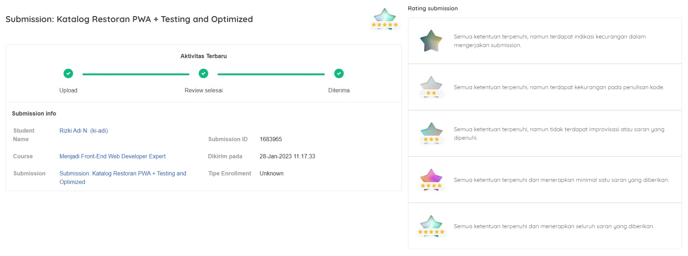
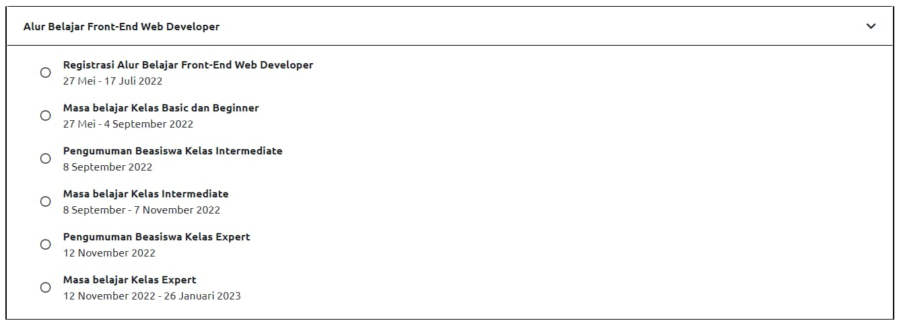

# Ganyem

## Overview
Ganyem is a Progressive Web App (PWA) that aims to serve as a restaurant catalog to help users browse restaurants, find menus, post a reviews and save their favorite restaurants. The web application has native-like capabilities, allowing it to be installed and accessed even in situations with slow or no internet connection like a smartphone application.

In addition to its native-like capabilities, Ganyem also features a responsive web design that ensures optimal display and usability across various devices. It prioritizes accessibility, making the app usable for a wide range of users, including those with disabilities. The application is designed to be easily maintained, allowing for efficient updates and enhancements. It also supports automated testing, enabling seamless and reliable testing processes. Lastly, Ganyem is optimized for performance, delivering fast and smooth user interactions.

After completing the intermediate class in the front-end learning path, I successfully passed and continued my learning in the advanced class provided by the [IDCamp 2022](https://idcamp.ioh.co.id/) program from Indosat Ooredoo Hutchison. 

This web application serves as the final project consisting of 3 submissions and serves as the determinant for completion of the ["Menjadi Front-End Web Developer Expert"](https://www.dicoding.com/academies/219) class at Dicoding and the overall completion of the IDCamp 2022 program.

## Installation
1. Clone the project repository to your local machine using a Git client or by downloading the project as a zip file.
```
git clone https://github.com/k1adi/ganyem-final
```
2. Navigate to the project's root directory in your terminal or command prompt.
```
cd ganyem-final
```
3. Install the project's dependencies.
```
npm install or yarn install
```
4. Run the application with development-mode 
```
npm run start-dev
```
5. Run the application with production-mode 
```
npm run build-serve 
```

This project uses webpack for building and serving the project, the package.json file provided contains several scripts for building, serving and development mode. Make sure you have the required version of Node.js and npm installed before running the above commands.

Alternatively, you can directly access the deployed web application at https://ganyem.netlify.app/

## Scripts
- `test`: Run the integration testing
- `test-e2e` : Run the e2e testing
- `test-lint` : Run the eslint
- `start-dev` : Run the web application with development version
- `start-build` : Build production version of the web application
- `start-serve` : Run production version of the web application
- `build-serve` : Build and run production version of the web application 
- `build-image` : Create image compression to production version

## Features
- Accessibility.
- Switch theme (light/dark).
- Displaying resto asynchronously.
- Search resto by name, category or menu.
- Post a review about resto.
- Add or remove favorite resto.

## Submission info




> *If you see 'Enrollment Type: Unknown', it is because of my misunderstanding and the delay in submitting the assignment. I was able to complete the class more than 2 days beyond the timeline set by IDCamp.*

## Author
- GitHub - [k1adi](https://github.com/k1adi)
- CodePen - [@k1adi](https://codepen.io/k1adi)
- Dicoding - [ki-adi](https://www.dicoding.com/users/ki-adi)

## License 
Copyright (c) 2023 k1adi

Permission is hereby granted, free of charge, to any person obtaining a copy of this software and associated documentation files (the “Software”), to deal in the Software without restriction, including without limitation the rights to use, copy, modify, merge, publish, distribute, sublicense, and/or sell copies of the Software, and to permit persons to whom the Software is furnished to do so, subject to the following conditions:

The above copyright notice and this permission notice shall be included in all copies or substantial portions of the Software.

THE SOFTWARE IS PROVIDED “AS IS”, WITHOUT WARRANTY OF ANY KIND, EXPRESS OR IMPLIED, INCLUDING BUT NOT LIMITED TO THE WARRANTIES OF MERCHANTABILITY, FITNESS FOR A PARTICULAR PURPOSE AND NONINFRINGEMENT. IN NO EVENT SHALL THE AUTHORS OR COPYRIGHT HOLDERS BE LIABLE FOR ANY CLAIM, DAMAGES OR OTHER LIABILITY, WHETHER IN AN ACTION OF CONTRACT, TORT OR OTHERWISE, ARISING FROM, OUT OF OR IN CONNECTION WITH THE SOFTWARE OR THE USE OR OTHER DEALINGS IN THE SOFTWARE.